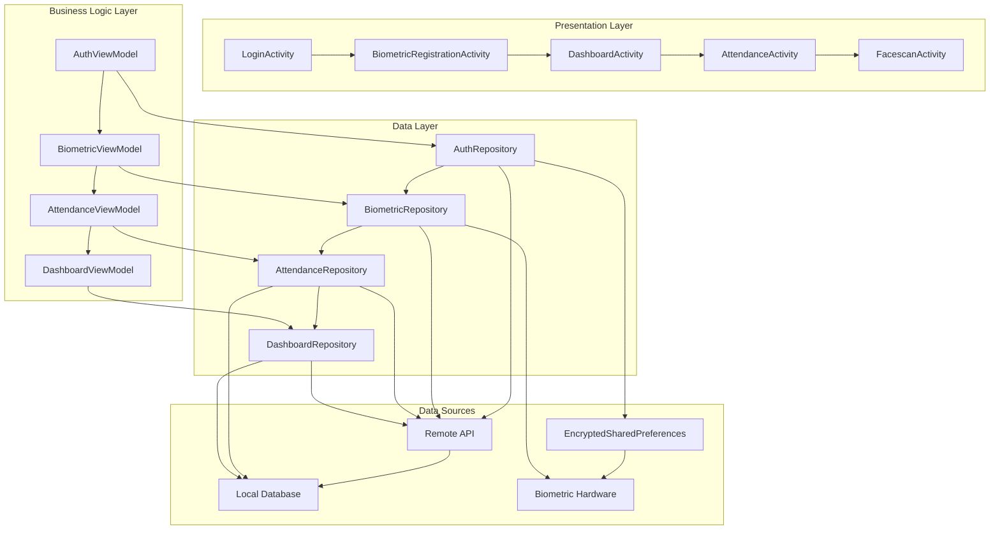

# Design Document

## Overview

The Employee Biometric Onboarding system transforms the existing RealEstate-CRM Android app into a comprehensive employee attendance management solution. The system leverages existing UI components from RegisterActivity and FacescanActivity while implementing a new flow focused on employee authentication, biometric registration, and attendance tracking.

The architecture follows MVVM pattern with Repository pattern for data management, utilizing existing dependencies like CameraX for face detection, AndroidX Biometric for fingerprint scanning, and ML Kit for face recognition. The system integrates with Django REST Framework APIs for backend communication and implements offline-first approach using Room database for data persistence.

## Architecture

### High-Level Architecture



### Technology Stack

- **UI Framework**: Android XML layouts with ViewBinding/DataBinding
- **Architecture**: MVVM with Repository pattern
- **Dependency Injection**: Manual DI (keeping existing approach, no Hilt)
- **Networking**: Retrofit with OkHttp (to be added - new dependency)
- **Local Storage**: Room Database (to be added - new dependency) + EncryptedSharedPreferences
- **Biometric**: AndroidX Biometric + CameraX + ML Kit Face Detection
- **Charts**: MPAndroidChart (already included)
- **Image Loading**: Glide (already included)
- **Location**: Android Location Services + Geocoder

## Components and Interfaces

### 1. Authentication Module

#### LoginActivity (Modified from existing)
- **Purpose**: Employee authentication using admin-provided credentials
- **Key Components**:
  - Username/Password input fields
  - Login button with loading state
  - Error handling for invalid credentials
  - Automatic redirect based on biometric registration status

#### AuthRepository
```kotlin
interface AuthRepository {
    suspend fun login(username: String, password: String): Result<LoginResponse>
    suspend fun saveAuthToken(token: String)
    suspend fun getAuthToken(): String?
    suspend fun isTokenValid(): Boolean
    suspend fun refreshToken(): Result<String>
    suspend fun isLoggedIn(): Boolean
    suspend fun logout()
    suspend fun saveEmployeeInfo(employeeInfo: EmployeeInfo)
    suspend fun getEmployeeInfo(): EmployeeInfo?
}
```

#### LoginResponse Data Model
```kotlin
data class LoginResponse(
    val token: String,
    val employee_id: String,
    val username: String,
    val biometrics_registered: Boolean,
    val employee_info: EmployeeInfo
)
```

### 2. Biometric Registration Module

#### BiometricRegistrationActivity (Modified from RegisterActivity)
- **Purpose**: Register employee biometrics after successful login
- **Key Components**:
  - Remove existing form fields (name, email, password)
  - Keep biometric scan buttons with updated styling
  - Sequential biometric registration flow
  - Progress indicators for registration steps
  - Integration with existing FacescanActivity

#### BiometricRepository
```kotlin
interface BiometricRepository {
    suspend fun registerBiometrics(employeeId: String, faceRegistered: Boolean, fingerprintRegistered: Boolean): Result<BiometricResponse>
    suspend fun checkBiometricAvailability(): BiometricAvailability
    suspend fun authenticateFingerprint(): Result<BiometricResult>
}
```

#### BiometricAvailability Data Model
```kotlin
data class BiometricAvailability(
    val hasFaceDetection: Boolean,
    val hasFingerprint: Boolean,
    val canAuthenticateFingerprint: Boolean
)
```

### 3. Dashboard Module

#### DashboardActivity (New)
- **Purpose**: Display attendance overview and provide attendance CTA
- **Key Components**:
  - Days present counter
  - Last check-in time display
  - Pie chart for present/absent visualization using MPAndroidChart
  - Leave information cards (sick leaves, other leaves)
  - "Take Attendance" floating action button
  - Professional navy/gold theme implementation

#### DashboardRepository
```kotlin
interface DashboardRepository {
    suspend fun getAttendanceOverview(): Result<AttendanceOverview>
    suspend fun getLeaveInformation(): Result<LeaveInfo>
}
```

#### AttendanceOverview Data Model
```kotlin
data class AttendanceOverview(
    val daysPresent: Int,
    val totalWorkingDays: Int,
    val lastCheckIn: String?,
    val presentPercentage: Float
)
```

### 4. Attendance Module

#### AttendanceActivity (New)
- **Purpose**: Handle attendance punching with biometric verification
- **Key Components**:
  - Bottom sheet drawer with biometric options
  - Integration with existing FacescanActivity for face scanning
  - Fingerprint authentication using AndroidX Biometric
  - Location capture using Android Location Services
  - Success/failure animations
  - Duplicate punch prevention logic

#### AttendanceRepository
```kotlin
interface AttendanceRepository {
    suspend fun checkIn(latitude: Double, longitude: Double, scanType: String): Result<AttendanceResponse>
    suspend fun checkOut(latitude: Double, longitude: Double, scanType: String): Result<AttendanceResponse>
    suspend fun getTodayAttendance(): Result<TodayAttendance?>
    suspend fun saveOfflineAttendance(attendance: OfflineAttendance)
    suspend fun syncOfflineAttendance(): Result<List<AttendanceResponse>>
    suspend fun canPunchAttendance(): Boolean
}
```

#### AttendanceResponse Data Model
```kotlin
data class AttendanceResponse(
    val id: String,
    val employee_id: String,
    val check_in_time: String?,
    val check_out_time: String?,
    val status: String,
    val message: String
)
```

### 5. Offline Support Module

#### Room Database Entities
```kotlin
@Entity(tableName = "offline_attendance")
data class OfflineAttendance(
    @PrimaryKey val id: String,
    val employeeId: String,
    val latitude: Double,
    val longitude: Double,
    val scanType: String,
    val attendanceType: String, // "check_in" or "check_out"
    val timestamp: Long,
    val synced: Boolean = false
)

@Entity(tableName = "attendance_cache")
data class AttendanceCache(
    @PrimaryKey val date: String,
    val lastPunchTime: Long,
    val hasCheckedIn: Boolean,
    val hasCheckedOut: Boolean
)
```

## Data Models

### Core Data Models

#### Employee Data Model
```kotlin
data class EmployeeInfo(
    val employee_id: String,
    val full_name: String,
    val email: String,
    val department: String,
    val designation: String
)
```

#### Biometric Registration Models
```kotlin
data class BiometricRegistrationRequest(
    val employee_id: String,
    val face_registered: Boolean,
    val fingerprint_registered: Boolean
)

data class BiometricResponse(
    val success: Boolean,
    val message: String,
    val employee_id: String
)
```

#### Attendance Models
```kotlin
data class CheckInRequest(
    val check_in_latitude: Double,
    val check_in_longitude: Double,
    val scan_type: String
)

data class CheckOutRequest(
    val check_out_latitude: Double,
    val check_out_longitude: Double,
    val scan_type: String
)

data class TodayAttendance(
    val hasCheckedIn: Boolean,
    val hasCheckedOut: Boolean,
    val checkInTime: String?,
    val checkOutTime: String?
)
```

### API Response Models
```kotlin
data class ApiResponse<T>(
    val success: Boolean,
    val message: String,
    val data: T?
)

sealed class Result<out T> {
    data class Success<out T>(val data: T) : Result<T>()
    data class Error(val exception: Throwable) : Result<Nothing>()
    data class Loading(val isLoading: Boolean = true) : Result<Nothing>()
}
```

## Error Handling

### Network Error Handling
- **Connection Timeout**: Show retry dialog with offline mode option
- **Server Errors (5xx)**: Display user-friendly error messages
- **Authentication Errors (401)**: Force logout and redirect to login
- **Validation Errors (400)**: Show specific field validation messages

### Biometric Error Handling
- **Hardware Not Available**: Show alternative authentication options
- **Biometric Not Enrolled**: Guide user to device settings
- **Authentication Failed**: Provide retry options with fallback
- **Face Detection Failed**: Improve lighting suggestions and retry

### Location Error Handling
- **Permission Denied**: Show permission rationale and settings redirect
- **Location Unavailable**: Allow manual location entry or retry
- **GPS Disabled**: Prompt user to enable location services

### Offline Error Handling
- **Network Unavailable**: Queue operations for later sync
- **Storage Full**: Clean old cached data and notify user
- **Sync Failures**: Retry with exponential backoff

## Testing Strategy

### Unit Testing
- **Repository Layer**: Mock API responses and database operations
- **ViewModel Layer**: Test business logic and state management
- **Utility Classes**: Test biometric availability, location services
- **Data Models**: Test serialization/deserialization

### Integration Testing
- **API Integration**: Test actual API calls with test server
- **Database Integration**: Test Room database operations
- **Biometric Integration**: Test hardware interaction flows
- **Location Integration**: Test location capture and geocoding

### UI Testing
- **Login Flow**: Test authentication with valid/invalid credentials
- **Biometric Registration**: Test sequential registration process
- **Attendance Flow**: Test check-in/check-out with different biometric types
- **Dashboard**: Test data display and navigation

### End-to-End Testing
- **Complete Onboarding**: From login to biometric registration
- **Daily Attendance**: Full check-in to check-out cycle
- **Offline Scenarios**: Test offline storage and sync
- **Error Scenarios**: Test various failure conditions

### Performance Testing
- **Face Detection**: Measure detection speed and accuracy
- **Database Operations**: Test query performance with large datasets
- **Memory Usage**: Monitor memory consumption during biometric operations
- **Battery Usage**: Test impact of continuous camera usage

### Security Testing
- **Token Storage**: Verify encrypted storage of JWT tokens
- **Biometric Data**: Ensure biometric data is not stored locally
- **API Communication**: Test HTTPS certificate validation
- **Permission Handling**: Test proper permission request flows

## Dependency Constraints

**Important Note**: All existing dependencies and versions in the project must remain unchanged. Only the following minimal new dependencies will be added if absolutely necessary:

### Required New Dependencies (Minimal Addition)
```kotlin
// For API communication
implementation("com.squareup.retrofit2:retrofit:2.9.0")
implementation("com.squareup.retrofit2:converter-gson:2.9.0")
implementation("com.squareup.okhttp3:logging-interceptor:4.11.0")

// For local database (offline support)
implementation("androidx.room:room-runtime:2.5.0")
implementation("androidx.room:room-ktx:2.5.0")
kapt("androidx.room:room-compiler:2.5.0")

// For location services
implementation("com.google.android.gms:play-services-location:21.0.1")
```

### Existing Dependencies to Leverage
- **CameraX**: Already included for face scanning
- **AndroidX Biometric**: Already included for fingerprint
- **ML Kit Face Detection**: Already included for face recognition
- **MPAndroidChart**: Already included for dashboard charts
- **Glide**: Already included for image loading
- **Material Design**: Already included for UI components
- **EncryptedSharedPreferences**: Part of AndroidX Security (to be used for token storage)

All existing versions in `gradle/libs.versions.toml` and `app/build.gradle.kts` will remain exactly as they are.
## Token
 Management & Security

### JWT Token Handling Strategy

#### Token Storage
- **Storage Method**: EncryptedSharedPreferences for secure token storage
- **Token Types**: Access token (JWT) from login response
- **Encryption**: AES-256 encryption for token storage
- **Key Management**: Android Keystore for encryption key storage

#### Token Lifecycle Management
```kotlin
class TokenManager {
    suspend fun saveToken(token: String)
    suspend fun getToken(): String?
    suspend fun isTokenExpired(): Boolean
    suspend fun clearToken()
    suspend fun getTokenExpirationTime(): Long?
}
```

#### Automatic Token Validation
- **Pre-Request Check**: Validate token before each API call
- **Expiration Handling**: Check JWT expiration time locally
- **Invalid Token Response**: Handle 401 responses from server
- **Auto-Logout**: Automatic logout on token expiration

#### API Request Interceptor
```kotlin
class AuthInterceptor(private val tokenManager: TokenManager) : Interceptor {
    override fun intercept(chain: Interceptor.Chain): Response {
        val token = tokenManager.getToken()
        val request = if (token != null && !tokenManager.isTokenExpired()) {
            chain.request().newBuilder()
                .addHeader("Authorization", "Bearer $token")
                .build()
        } else {
            // Handle expired token - redirect to login
            chain.request()
        }
        
        val response = chain.proceed(request)
        
        // Handle 401 responses
        if (response.code == 401) {
            tokenManager.clearToken()
            // Trigger logout flow
        }
        
        return response
    }
}
```

#### Token Security Features
- **Secure Storage**: Never store tokens in plain SharedPreferences
- **Memory Protection**: Clear token from memory after use
- **Session Management**: Track token validity across app lifecycle
- **Logout Security**: Complete token cleanup on logout

#### Error Handling for Token Issues
- **Expired Token**: Automatic redirect to login screen
- **Invalid Token**: Clear stored credentials and show login
- **Network Issues**: Graceful handling with retry mechanism
- **Token Corruption**: Fallback to re-authentication

#### Implementation Details
```kotlin
// Secure token storage implementation
class SecureTokenStorage(private val context: Context) {
    private val masterKey = MasterKey.Builder(context)
        .setKeyScheme(MasterKey.KeyScheme.AES256_GCM)
        .build()
    
    private val encryptedPrefs = EncryptedSharedPreferences.create(
        context,
        "auth_prefs",
        masterKey,
        EncryptedSharedPreferences.PrefKeyEncryptionScheme.AES256_SIV,
        EncryptedSharedPreferences.PrefValueEncryptionScheme.AES256_GCM
    )
    
    fun saveToken(token: String) {
        encryptedPrefs.edit().putString("jwt_token", token).apply()
        // Also save token expiration time for local validation
        val expirationTime = extractExpirationFromJWT(token)
        encryptedPrefs.edit().putLong("token_expiration", expirationTime).apply()
    }
    
    fun getToken(): String? = encryptedPrefs.getString("jwt_token", null)
    
    fun isTokenExpired(): Boolean {
        val expirationTime = encryptedPrefs.getLong("token_expiration", 0)
        return System.currentTimeMillis() > expirationTime
    }
    
    fun clearToken() {
        encryptedPrefs.edit().clear().apply()
    }
}
```